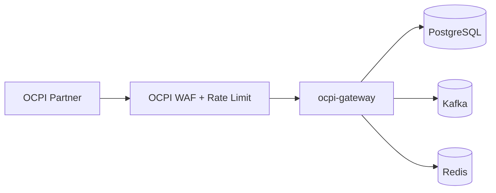

OCPI Gateway Architecture

Purpose
- Standalone OCPI integration plane for roaming and partner connectivity.
- Supports both CPO and eMSP roles in a single service.

Core Responsibilities
- Versions and Credentials exchange.
- Commands sender/receiver with async callbacks.
- Sessions and CDR ingestion and export.
- ChargingProfiles for smart charging.

Dependencies
- PostgreSQL for partner registry and OCPI object storage.
- Kafka for event publishing to CPMS/SSE.
- Redis for token cache and rate limiting.
- Kafka contracts: see `ocpi-gateway/docs/kafka-contracts.md`.

Request Flow (Ingress)

