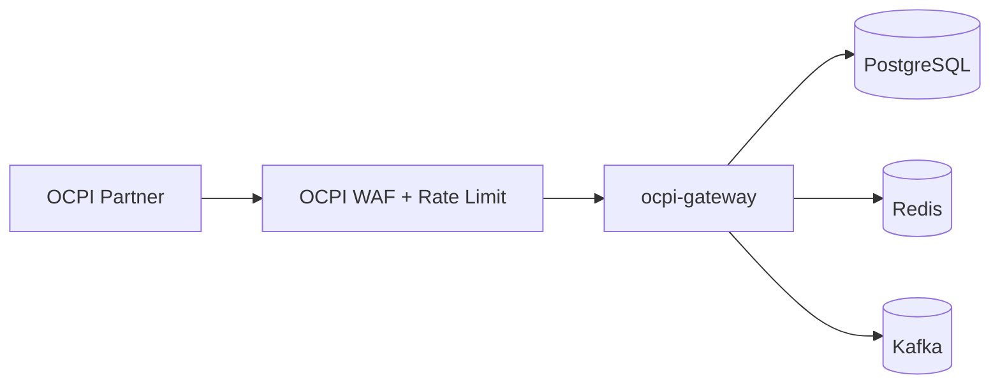

OCPI Gateway Deployment

Runtime
- Node.js service (NestJS) as a standalone gateway.
- Stateless pods behind L7 ingress.

Ports and Health
- HTTP port: `PORT` (default 3003).
- Health: `GET /health`.

Scaling
- Scale by partner traffic and callback volume.
- Enforce per-partner rate limits and circuit breakers.

Deployment Topology

